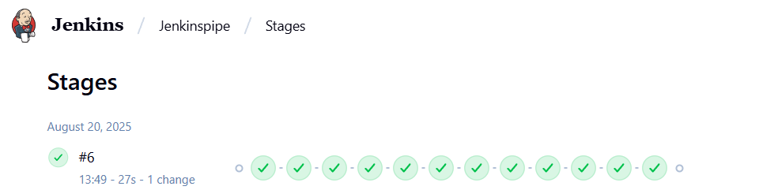
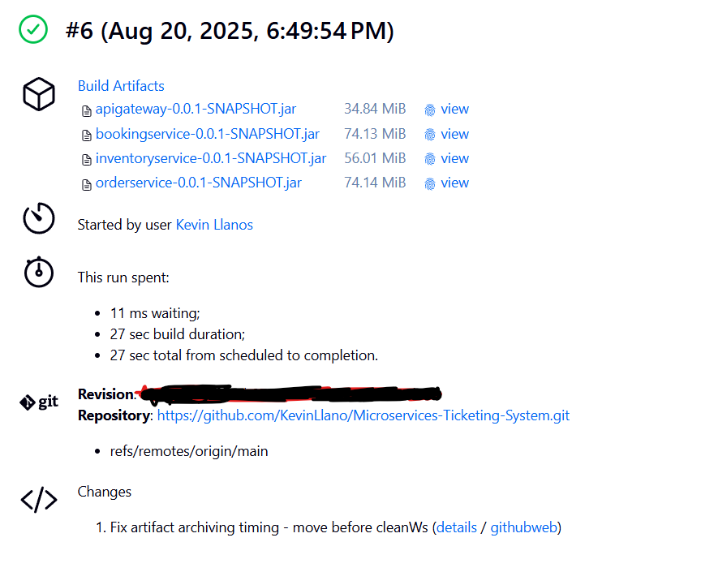
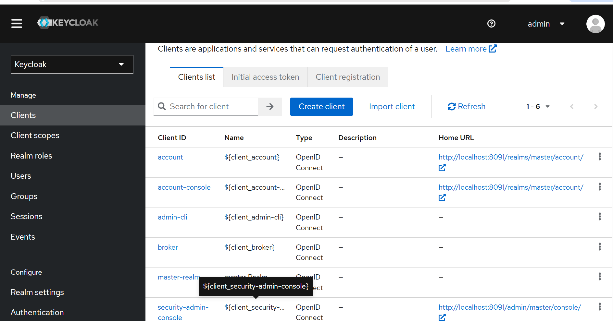
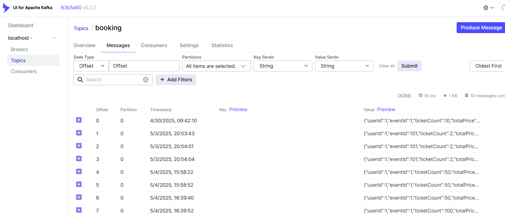
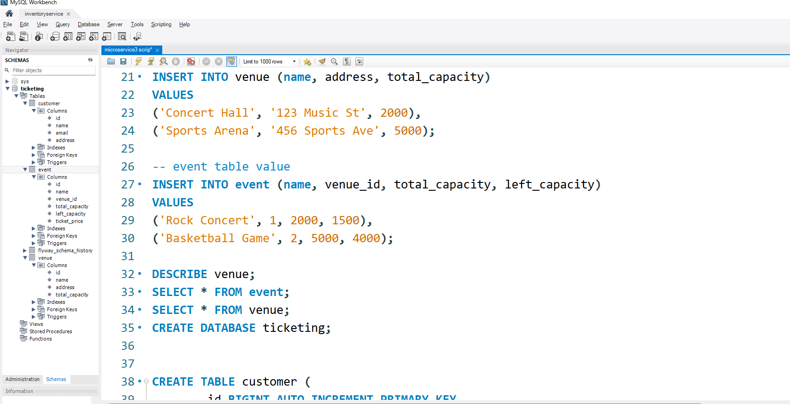
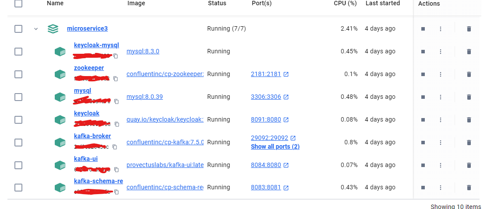
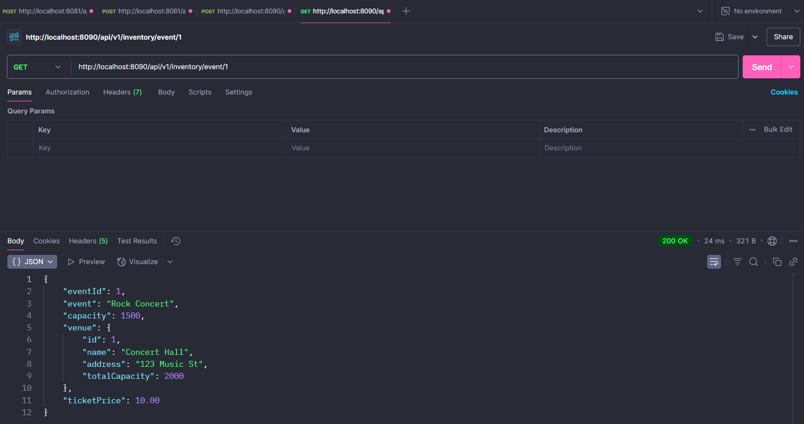
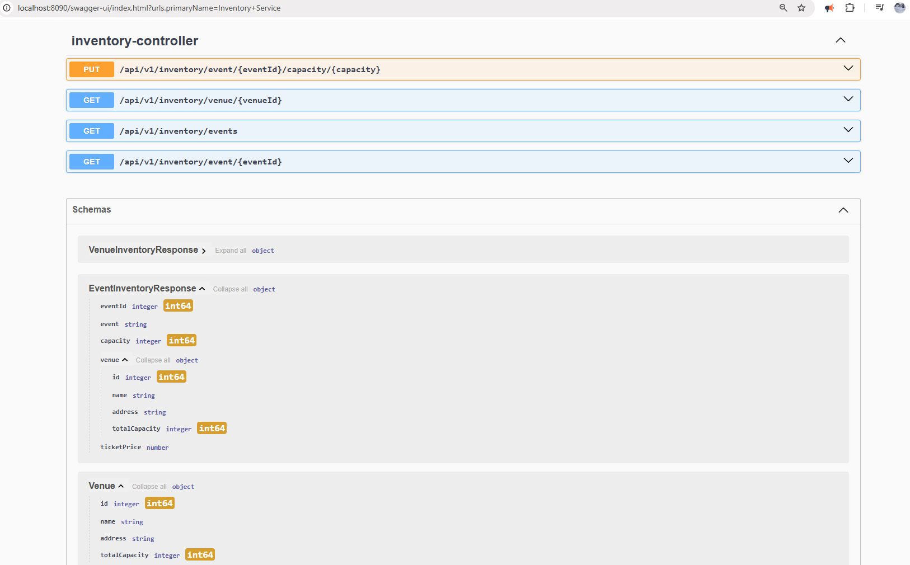

# **Microservice3** 

## 📖 Overview

**Microservice3** is a ticketing system built with a microservices architecture using Spring Boot. It includes four core services: Inventory, Booking, Order, and an API Gateway. Each service communicates through REST APIs and Kafka for event-driven operations. Keycloak handles authentication, and all components are containerized using Docker and orchestrated with Docker Compose.

- **Inventory Service** – Manages venue and event capacities.
- **Booking Service** – Handles booking requests and ticket validation.
- **Order Service** – Listens to booking events and creates orders.
- **API Gateway** – Routes client requests and enforces security via Keycloak.

All services are containerized with Docker and use **Apache Kafka** for asynchronous communication. **Keycloak** provides OAuth2-based authentication. **MySQL** is used for data persistence, with **Flyway** handling schema migrations.

---

## 🛠 Tools & Technologies Used

### Languages & Frameworks
- Java 21
- Spring Boot (Web, Data JPA, Security)
- Lombok

### Architecture & Communication
- Microservices
- REST APIs
- Apache Kafka (event-driven architecture)

### Database & Migrations
- MySQL
- Flyway

### Authentication & Security
- Keycloak (OAuth2 Resource Server)

### Containerization & Orchestration
- Docker
- Docker Compose

### DevOps & CI/CD
- Maven
- Git
- Jenkins (optional)

### Tools
- Postman (API testing)
- Kafka UI
- IntelliJ IDEA

---

## 🚀 Features

- ✅ Event & Venue Inventory Management
- ✅ Real-time Booking Validation
- ✅ Kafka-Powered Order Processing
- ✅ API Gateway Routing with OAuth2 Security
- ✅ Dockerized Environment with Isolated Services

---

### Setup & Installation

1. **Clone the Repository**
   ```bash
   git clone https://github.com/yourusername/inventory-booking-service.git
   cd inventory-booking-service
   ```

2. **Start Docker Services**
   ```bash
   docker-compose up -d
   ```

3. **Configure Application Properties**
   - Update `src/main/resources/application.properties` with MySQL and Kafka settings.

4. **Run the Services**
   Navigate to each service directory and run:
   ```bash
   mvn spring-boot:run
   ```
   Run in this order:
   - `inventoryservice`
   - `bookingservice`
   - `orderservice`
   - `apigateway`

5. **Test APIs**
   - **Inventory Service**:
     - `http://localhost:8080/api/v1/inventory/venue/1`
     - `http://localhost:8080/api/v1/inventory/events`
   - **Booking Service**:
     - `http://localhost:8081/api/v1/booking`
     - Example POST data:
       ```json
       {
         "userId": 1,
         "eventId": 1,
         "ticketCount": 50
       }
       ```

6. **Stop Services**
   ```bash
   docker-compose down
   ```

### **INVENTORY SERVICE**

**Steps:**

1. Go to [start.spring.io](https://start.spring.io)

   * Project: Maven
   * Spring Boot: 3.4.2
   * Packaging: Jar
   * Java: 21
   * Name: `inventoryservice`
   * Group: `kevinll`
   * Dependencies: Spring Web, Lombok, Spring Data JPA, MySQL Driver, Flyway Migration

2. Open the project in IntelliJ.
   Create a package `controller` and file `InventoryController`.

3. Create a package `response` and file `EventInventoryResponse`.

4. Create a package `service` and file `InventoryService`.
   Ensure `EventRepository` and `VenueRepository` are implemented for DB access.

5. Create a package `repository` and interfaces:

   * `EventRepository`
   * `VenueRepository`

6. Create a package `entity`, add class `Venue`.
   Add `@Getter`, `@Setter`, and annotate the table name.

7. In the `entity` folder, create `Event` class.

8. In the `response` package, add class `VenueInventoryResponse`.

9. Create `docker-compose.yml` in root for MySQL.
   Then, under root create folder `docker/mysql/init.sql`.

10. Ensure DB credentials are in `application.properties`.

11. Under `resources`, create folder `db.migration`, and add Flyway script `V1__init.sql`.

12. Populate MySQL `flyway_schema` with sample `event` and `venue` data.
    Example: `("Cars", 1, 20000, 20000);`

13. Run the application by creating a run config with `InventoryserviceApplication.java`.

14. Test APIs with Postman:

    * GET `http://localhost:8080/api/v1/inventory/venue/1`
    * GET `http://localhost:8080/api/v1/inventory/events`

---

### **BOOKING SERVICE**

15. Go to [start.spring.io](https://start.spring.io)

    * Group: `kevinll`
    * Artifact: `bookingservice`
    * Same setup
    * Dependencies: Spring Web, Lombok, Spring Data JPA, MySQL Driver, Spring for Apache Kafka

16. Open in IntelliJ. Create folder `controller` and file `BookingController`.

17. Create folder `service`, add file `BookingService`.

18. Create folder `request`, add file `BookingRequest` (DTO-like).

19. Create folder `response`, add file `BookingResponse` (DTO-like).

20. In `inventoryservice/db.migration`, add:

    * `V2_add_ticket.sql`
    * `V3_create_customer_table.sql`
    * `V4_create_order_table.sql`

21. If errors:
    Run:

    ```sql
    SET SQL_SAFE_UPDATES = 0;
    DELETE FROM ticketing.flyway_schema_history WHERE version = 4;
    ```

22. In `bookingservice`, create `repository` and interface `CustomerRepository`.

23. Create package `entity`, add class `Customer`.

24. Create package `client`, add class `InventoryServiceClient`.

25. In `response`, create `InventoryResponse`:
    Include fields like `eventId`, `event`, `capacity`, `venue: VenueResponse`.

26. In `response`, create class `VenueResponse`.

27. Set `application.properties` with port `8081`.
    Add run config: `bookingservice`.

28. Run Docker, `inventoryservice`, and `bookingservice`.

---

### **KAFKA**

29. In `inventoryservice`, extend `docker-compose.yml` with:

    * `zookeeper:`
    * `kafka-broker:`
    * `kafka-ui:`
    * `kafka-schema-registry:`
      Run:

    ```
    docker compose down
    docker compose up -d
    ```

30. In `bookingservice`, create `event` package and class `BookingEvent`.

31. In `BookingService.java`, add Kafka setup and method `createBookingEvent` with `kafkaTemplate.send()`.

32. In `application.properties`, add Kafka port `9092`.
    Verify in Docker.

33. In Postman, test POST:
    `http://localhost:8081/api/v1/booking`
    Ensure 200 OK to trigger topic.

34. Go to `localhost:8084` (Kafka UI).
    Use:

    * Cluster: `localhost`
    * Bootstrap server: `kafka-broker:29092`

---

### **ORDER SERVICE**

35. Go to [start.spring.io](https://start.spring.io)

    * Artifact: `orderservice`
    * Same config and dependencies

36. In `orderservice`, create `service` with class `OrderService`.

37. Add package `example.kevinll.bookingservice`, with class `BookingEvent`.

38. Create `entity` package, class `Order`.

39. Create `repository` package, interface `OrderRepository`.

40. In `inventoryservice`, add `@PutMapping` in `InventoryController` for capacity update.

41. In `orderservice`, create `client` package with `InventoryServiceClient`.

42. Ensure `application.properties` is configured with DB/Kafka ports.

43. Match path for `BookingEvent`, add `@KafkaListener` in `OrderService`.

44. Run all services and test with Postman:

    * GET: `http://localhost:8080/api/v1/inventory/event/1`
    * POST: `http://localhost:8081/api/v1/booking`
    * SQL: `SELECT * FROM ticketing.order;`

---

### **API GATEWAY**

45. Go to [start.spring.io](https://start.spring.io)

    * Artifact: `apigateway`
    * Add dependency: Gateway

46. In IntelliJ, create package `route`:

    * `InventoryServiceRoutes`
    * `BookingServiceRoutes`

47. In `application.properties`, set port `8090`.

48. Run all services including `apigateway`.
    Test with Postman:

    * POST `http://localhost:8090/api/v1/booking`

      ```json
      { "userId": 1, "eventId": 1, "tocketCount": 50 }
      ```
    * GET `http://localhost:8090/api/v1/inventory/event/1`

---

### **SPRING SECURITY WITH KEYCLOAK**

49. In `inventoryservice/docker-compose.yml`, add `keycloak-db:` and `keycloak:`
    Use unused port (e.g., 8091)

50. Run:

    ```
    docker compose up -d
    ```

    Visit `localhost:8091`, login with `admin/admin`
    Create a Realm (e.g., `ticketing-security-realm`)

51. Set up Keycloak clients under the created realm.

52. In `apigateway`, add dependency:

    ```xml
    <artifactId>spring-boot-starter-oauth2-resource-server</artifactId>
    ```

53. Create package `config`, class `SecurityConfig`.

54. In `application.properties`, configure Keycloak.
    Test authorization on:

    * `http://localhost:8090/api/v1/booking`
    * `http://localhost:8090/api/v1/inventory/event/1`

### ⚠️ Application Technical Challenges

#### 1. Microservice Coordination
Running multiple Spring Boot apps alongside Kafka, MySQL, and Keycloak in Docker Compose requires careful orchestration and port management.

#### 2. Flyway Migration Conflicts
Schema versioning across services can lead to `flyway_schema_history` conflicts, especially during parallel development or rollback scenarios.

#### 3. Inter-Service Communication
Implementing reliable Kafka event publishing/consumption and REST client calls (e.g., `InventoryServiceClient`) introduces serialization and network concerns.

#### 4. Security Integration
Configuring Keycloak with Spring Security and OAuth2 Resource Server in the API Gateway involves precise token validation and role mapping.

### ⚠️ CI/CD (Jenkins) – Issues Encountered & Resolutions

| Issue | Symptom | Fix |
|-------|---------|-----|
| Jenkins home volume permissions | Repeating `Permission denied` writing `copy_reference_file.log` | Recreate container & ensure host dir owned by uid 1000 (or run container as root for local dev): `chown -R 1000:1000 jenkins-data` or add `user: root` temporarily. |
| Docker socket permission | `permission denied while trying to connect to the Docker daemon socket` | Add Jenkins user to docker group in custom Jenkins image or run with `-v /var/run/docker.sock:/var/run/docker.sock` plus `groupadd -for docker && usermod -aG docker jenkins`. For quickest local test run container as root. |
| `mvnw: Permission denied` | Build stage exit code 126 | Commit executable flag: `git update-index --chmod=+x */mvnw` (Windows users may need `wsl` or manual chmod in container). |
| Missing artifacts to archive | Post stage error: `No artifacts found '**/target/*.jar'` | Ensure build not cleaned before archiving. Move `archiveArtifacts` before `cleanWs` or remove workspace wipe. |
| Workspace not a Git repo after restart | `fatal: not in a git directory` | Wipe workspace (`Workspace -> Wipe out`) then rebuild so Jenkins re-clones. |
| Early ECR/ECS integration noise | Auth / login failures | Defer cloud push until local pipeline (build + local image build) is green. |

### Jenkins Local Pipeline – Quick Replication Steps
1. Build / rebuild Jenkins (custom image if adding docker group) and start only Jenkins: `docker compose up -d jenkins` (or `docker run -d -p 8080:8080 -v jenkins-data:/var/jenkins_home -v /var/run/docker.sock:/var/run/docker.sock --name jenkins jenkins/jenkins:lts`)
2. Get initial password: `docker exec -it jenkins cat /var/jenkins_home/secrets/initialAdminPassword` and finish setup (Suggested plugins + Docker + Pipeline + Git + Credentials + Workspace Cleanup optional).
3. Fix Docker access (choose one):
   - Preferred: custom Dockerfile adding Jenkins user to docker group.
   - Fast: run container as root (local only).
4. Ensure `mvnw` scripts executable (inside repo root): `git update-index --chmod=+x apigateway/mvnw bookingservice/mvnw inventoryservice/mvnw orderservice/mvnw && git commit -m "chmod mvnw" && git push`.
5. Create Multibranch or Pipeline job pointing to repo (Jenkinsfile at root).
6. Run build. Verify stages: Checkout -> Build JARs (parallel) -> (optional) Build Docker Images.
7. If Docker build fails with socket permission denied, apply step 3 fix then rebuild.
8. If artifact archiving needed: place `archiveArtifacts artifacts: '**/target/*.jar'` BEFORE any workspace cleanup; or remove `cleanWs` post step.
9. To reset stuck workspace: Wipe via UI or `docker exec -it jenkins bash -lc 'rm -rf /var/jenkins_home/workspace/Jenkinspipe*'` then rebuild.
10. Tag & build images locally only (increment a BUILD_NUMBER env var or use Jenkins `${BUILD_NUMBER}`).
11. After success, introduce ECR: create repo, add AWS creds in Jenkins, then add a push stage (login via `aws ecr get-login-password | docker login ...`).
12. Later extend with Terraform (ECR, ECS Cluster, Fargate Service) once images push reliably.

### Notes
- Defer ECS until local CI is stable.
- Keep Dockerfile per service minimal (multi-stage build recommended for production).
- Avoid cleaning workspace before archiving deliverables.
- Windows host users: line endings and execute bit require attention; prefer committing from WSL or enabling core.autocrlf=false.

### Minimal Jenkinsfile Pattern DEMO purposes (Local Build Only) 
```
pipeline {
  agent any
  stages {
    stage('Build JARs') {
      parallel {
        stage('apigateway'){ steps { dir('apigateway'){ sh './mvnw -B clean package -DskipTests' } } }
        stage('bookingservice'){ steps { dir('bookingservice'){ sh './mvnw -B clean package -DskipTests' } } }
        stage('inventoryservice'){ steps { dir('inventoryservice'){ sh './mvnw -B clean package -DskipTests' } } }
        stage('orderservice'){ steps { dir('orderservice'){ sh './mvnw -B clean package -DskipTests' } } }
      }
    }
    stage('Build Images (local)') {
      parallel {
        stage('apigateway image'){ steps { dir('apigateway'){ sh 'docker build -t apigateway:${BUILD_NUMBER} .' } } }
        stage('bookingservice image'){ steps { dir('bookingservice'){ sh 'docker build -t bookingservice:${BUILD_NUMBER} .' } } }
        stage('inventoryservice image'){ steps { dir('inventoryservice'){ sh 'docker build -t inventoryservice:${BUILD_NUMBER} .' } } }
        stage('orderservice image'){ steps { dir('orderservice'){ sh 'docker build -t orderservice:${BUILD_NUMBER} .' } } }
      }
    }
  }
  post {
    success {
      archiveArtifacts artifacts: '**/target/*.jar', fingerprint: true
    }
    cleanup {
      // Optional: cleanWs()  // enable only if not archiving or archive first
    }
  }
}
```

### ⚠️ AWS Cloud Deployment (ECR/ECS) – Additional Challenges & Solutions

Problems encountered during AWS ECR/ECS deployment and their resolutions:

| Issue | Symptom | Root Cause | Fix |
|-------|---------|------------|-----|
| Docker image not found in ECR | `CannotPullContainerError: pull image manifest has been retried 1 time(s): failed to resolve ref` | Image was never pushed to ECR repository | Build JAR → Build Docker image → Authenticate with ECR → Tag image → Push to ECR |
| Java runtime version mismatch | `UnsupportedClassVersionError: class file version 65.0, this version only recognizes up to 61.0` | Application compiled with Java 21 but Dockerfile used OpenJDK 17 | Update Dockerfile base image from `openjdk:17-jdk-slim` to `openjdk:21-jdk-slim` |
| Container port mismatch | ECS task fails health checks, exits with code 1 | Dockerfile exposes port 8080 but Spring Boot configured for 8090 | Align ports: either change `server.port=8080` in application.properties OR update ECS task definition containerPort |
| Keycloak localhost dependency | Application startup failures in ECS | JWT issuer URI points to `localhost:8091` which doesn't exist in cloud | Comment out Keycloak configuration for initial cloud deployment or point to external auth service |
| Configuration syntax errors | Spring Boot startup fails with property parsing errors | Typo in `spring.security.oauth2.resourceserver.jwt,issuer-uri` (comma instead of dot) | Fix property key: `spring.security.oauth2.resourceserver.jwt.issuer-uri` |

### AWS ECR/ECS Deployment Guide

#### Prerequisites
1. **AWS CLI configured** with credentials:
   ```bash
   aws configure
   # Enter: Access Key ID, Secret Access Key, Region (us-east-1), Output format (json)
   ```

2. **Terraform infrastructure deployed** (ECR repository + ECS cluster + task definition + service)

#### Deployment Steps

1. **Build Application JAR**
   ```bash
   cd apigateway
   ./mvnw clean package -DskipTests
   ```

2. **Build Docker Image**
   ```bash
   docker build -t microservices-apigateway:latest .
   ```

3. **Authenticate Docker with ECR**
   ```bash
   aws ecr get-login-password --region us-east-1 | docker login --username AWS --password-stdin <account-id>.dkr.ecr.us-east-1.amazonaws.com
   ```

4. **Tag Image for ECR**
   ```bash
   docker tag microservices-apigateway:latest <account-id>.dkr.ecr.us-east-1.amazonaws.com/microservices-apigateway:latest
   ```

5. **Push Image to ECR**
   ```bash
   docker push <account-id>.dkr.ecr.us-east-1.amazonaws.com/microservices-apigateway:latest
   ```

6. **Verify ECS Deployment**
    - AWS Console → ECS → Clusters → microservices-cluster → Services → apigateway-service
    - Check task status: should show "RUNNING"
    - Get public IP from task details
    - Test endpoint: `http://<public-ip>:8080/actuator/health`

#### Cost Optimization Notes
- **Estimated Monthly Cost**: $8-13/month for single service (256 CPU, 512MB RAM, 24/7)
- **Cost-saving strategies**:
    - Scale to 0 when not needed: `aws ecs update-service --cluster microservices-cluster --service apigateway-service --desired-count 0`
    - Use spot instances for development
    - Set CloudWatch log retention to 1 day
    - Use default VPC (no NAT Gateway costs)

#### Troubleshooting
- **Task keeps stopping**: Check CloudWatch logs at `/ecs/apigateway`
- **Can't access application**: Verify security group allows inbound port 8080

### ⚠️ Screenshots








